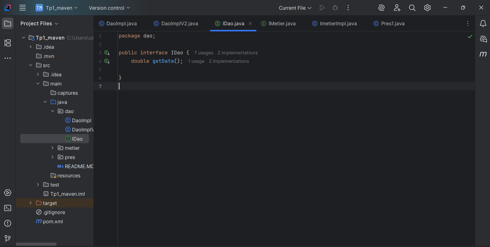
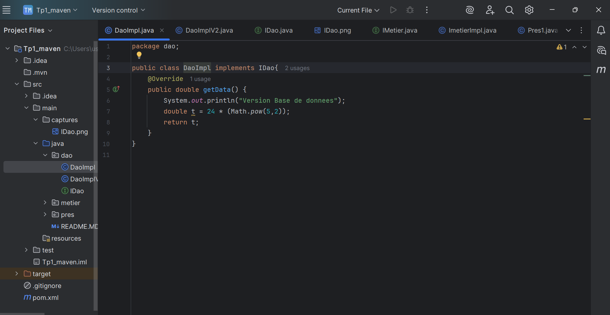
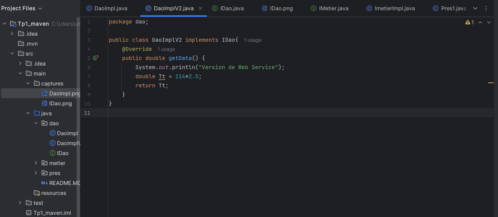
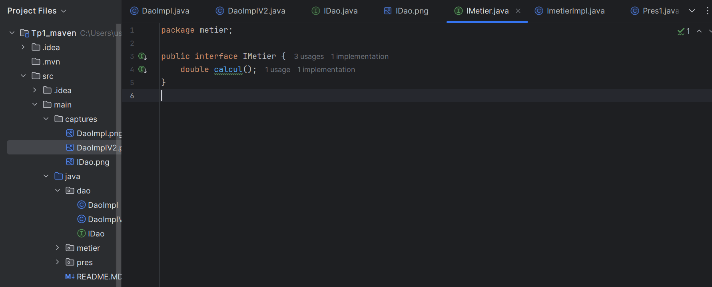
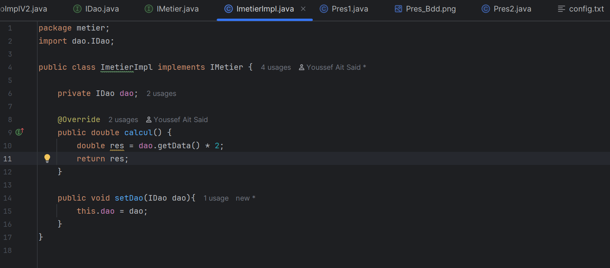

<h1 style="color:red">Compte Rendu Tp1</h1>

    <h2 style="color:green">Partie 1</h2>

    <h5>1. Créer l'interface IDao avec une méthode getData:</h5>
    
    <h5>2. Créer une implémentation de cette interface:</h5>
    
Version de Base de donnees(DaoImpl.java)

    
    
Version de Web Services(DaoImplV2.java)

    
    <h5>3. Créer l'interface IMetier avec une méthode calcul:</h5>
    
    <h5>4. Créer une implémentation de cette interface en utilisant le couplage faible:</h5>
    
    <h5>5. Faire l'injection des dépendances :</h5>
    <section>
        <h6>a. Par instanciation statique:</h6>
            
Version de Base de Donnees

                
            
Version de Web Services

                
    </section>

